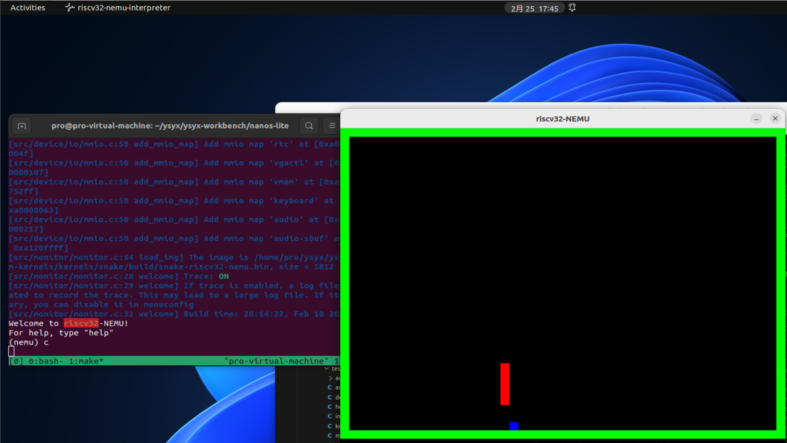
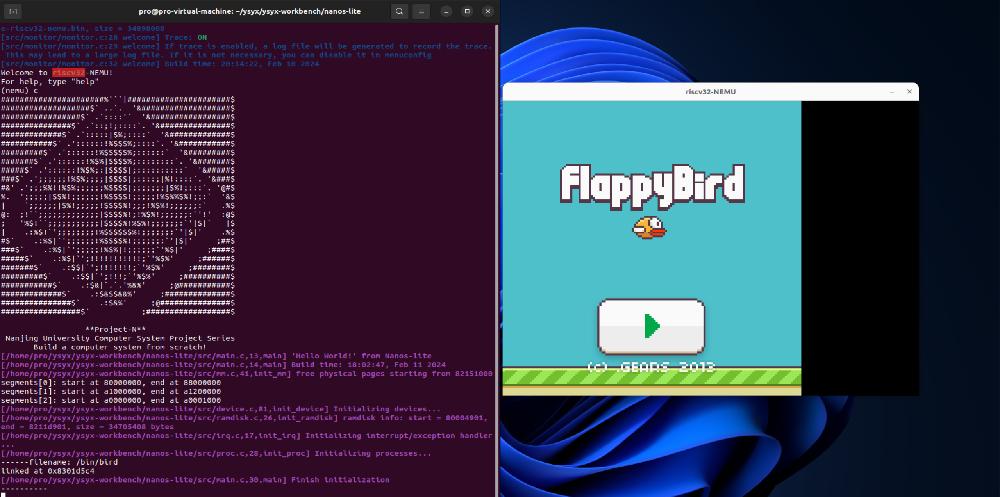
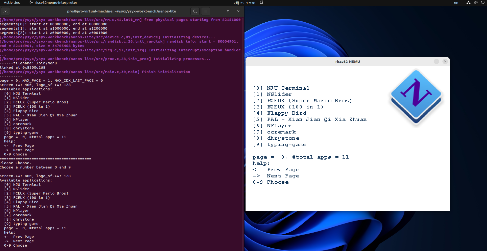
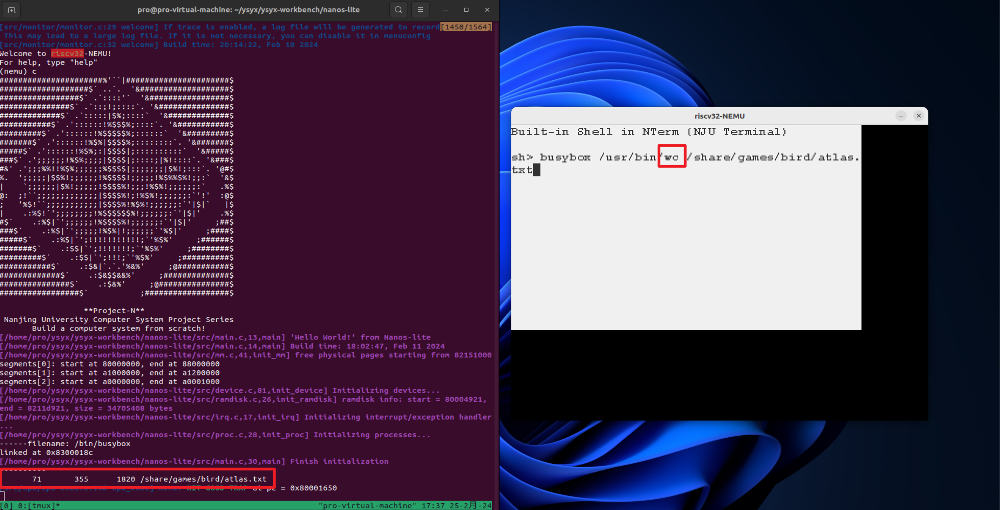
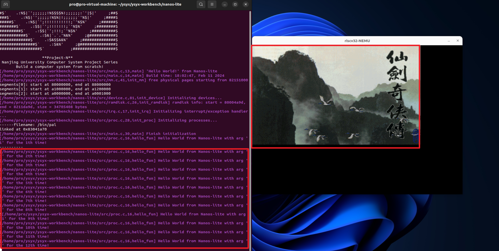
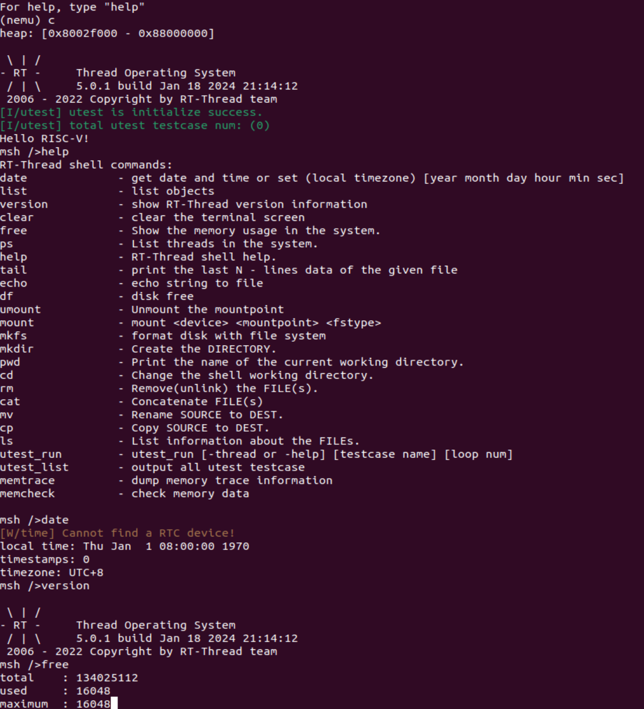
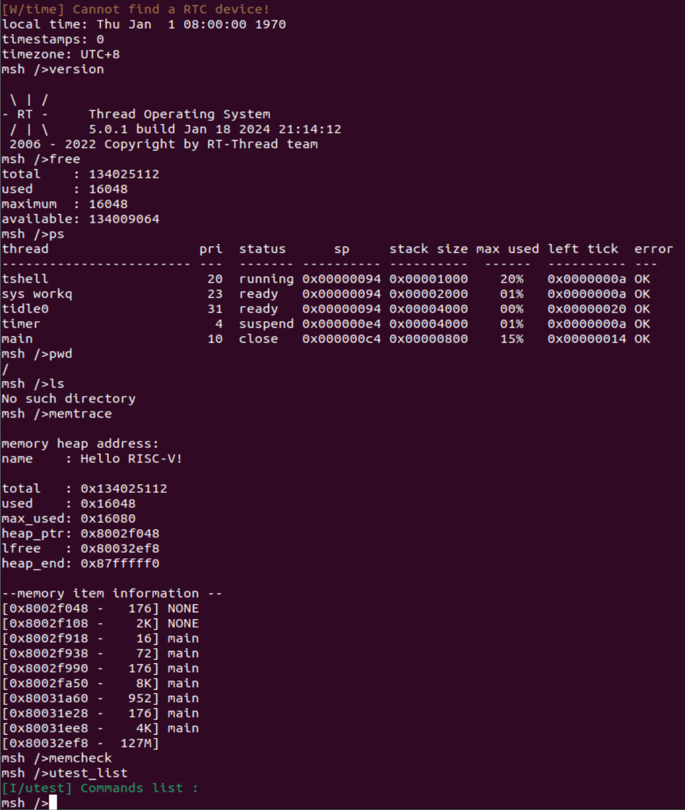

 	 从“零”开始搭建基于Risc-V架构的完整的计算机系统，实现了一个功能完备的模拟器——NEMU，实现了基于NEMU的裸机运行时环境(AM——Abstract  Machine)，基于AM编写了操作系统内核，最终实现基于虚存管理的多道程序执行，实现了抢占式的分时多任务，可以运行游戏“仙剑奇侠传”等用户程序；另外还将编写的基于NEMU的裸机运行时环境(AM)接入到了RT-Thread中。在项目调试方面，实现各种trace、实现类GDB的简易调试器、接入Spike进行difftest等调试手段  

- NEMU: 实现基于Risc-V指令集的CPU模拟器，以及实现硬件层的bug调试方法 
- AM: 包括库函数的调用、输入输出等程序运行时环境
- 操作系统：实现loader、异常处理机制、简易文件系统、系统调用、进程调度、上下文切换、开启分页机制等  

- 其他功能: 接入RT-Thread系统、快照、接入busybox、内建shell、支持menuconfig配置裁剪

### 实现库函数

- 实现stdio.c、stdlib.c、string.c下的一些常见库函数

### 实现的系统调用

- 9 system calls

	- open, read, write, lseek, close, gettimeofday, brk, exit, execve

	

## 效果显示

### 运行贪吃蛇游戏

### 运行FlyBird游戏

### 运行开机菜单

### 接入Busybox

###  分页机制之下同时运行内核线程与用户进程

### 接入RT-Thread

